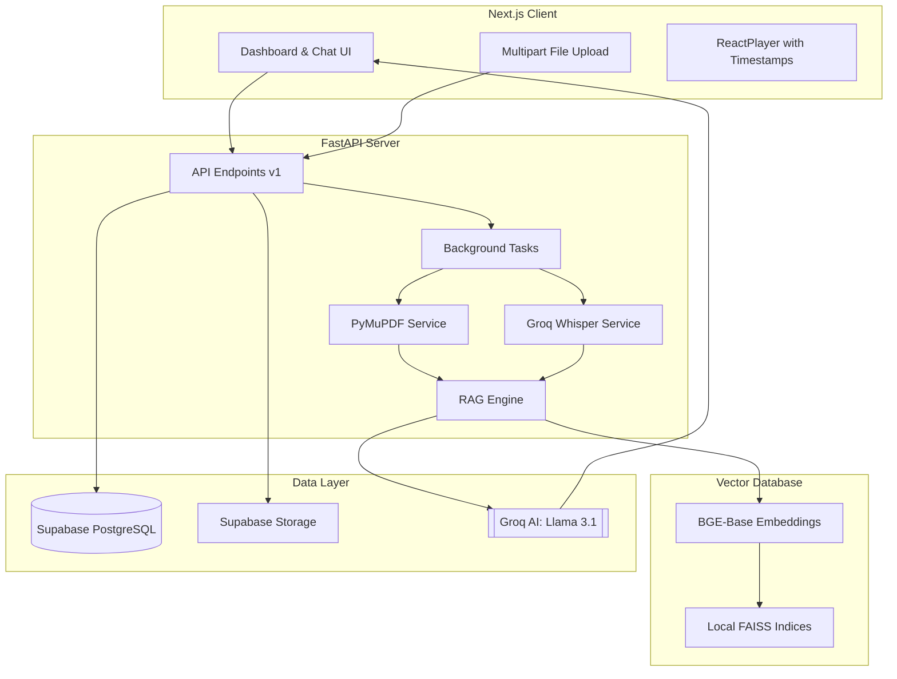

# PanScience Innovations: Multimedia RAG Engine

A high-performance, production-ready Retrieval-Augmented Generation (RAG) platform designed for seamless interaction with PDF, Audio, and Video content.

## 🚀 Overview

PanScience Innovations leverages state-of-the-art AI to transform static multimedia files into interactive knowledge bases. Users can upload documents, listen to recordings, or watch videos while simultaneously chatting with an AI that has deep contextual understanding of the content, including precise timestamp retrieval for media files.

## 🏗️ System Architecture



## 🛠️ Tech Stack

### Frontend
- **Framework**: Next.js 14+ (App Router)
- **Styling**: Tailwind CSS
- **UI Components**: Radix UI / Shadcn UI
- **Media**: React-Player
- **Icons**: Lucide React
- **State Management**: React Hooks & Context

### Backend
- **Framework**: FastAPI (Asynchronous Python)
- **RAG Orchestration**: LangChain
- **Vector Store**: FAISS (Facebook AI Similarity Search)
- **Embeddings**: BAAI/bge-base-en-v1.5 (Local execution)
- **Text Extraction**: PyMuPDF (fitz)
- **Audio/Video Transcription**: Groq Whisper-v3 (Large)
- **Large Language Model**: Groq Llama-3.1-8b-Instant

### Infrastructure
- **Database**: Supabase (PostgreSQL)
- **Storage**: Supabase Buckets
- **Task Management**: FastAPI BackgroundTasks

## 🔄 Data Flow

### 1. Ingestion Pipeline
1. **Upload**: User uploads a file (PDF/MP3/MP4/OGG) via the frontend.
2. **Persistence**: The file is stored in Supabase Storage, and a record is created in the `uploaded_files` table with a `processing` status.
3. **Extraction**:
   - **PDF**: Text is extracted page-by-page.
   - **Multimedia**: Audio is transcribed using Groq Whisper, generating timestamped segments.
4. **Vectorization**: Extracted text is split into chunks and embedded using the BGE model.
5. **Indexing**: Chunks are stored in a local FAISS index unique to the `file_id`.
6. **Ready**: The file status is updated to `ready`.

### 2. Retrieval & Chat Pipeline
1. **Query**: User sends a question.
2. **Context Retrieval**: The RAG engine identifies relevant chunks from the FAISS index.
3. **Augmentation**: The query and retrieved context are formatted into a system prompt.
4. **Generation**: Groq Llama 3.1 generates a response based **only** on the provided context.
5. **Persistence**: Both user and assistant messages are saved to the `chat_history` table for persistence.

## 🛠️ Installation & Setup

### Prerequisites
- Python 3.10+
- Node.js 18+
- Supabase Project
- Groq API Key

### Backend Setup
1. `cd backend`
2. `python -m venv venv`
3. `.\venv\Scripts\activate`
4. `pip install -r requirements.txt`
5. Create `.env`:
   ```env
   SUPABASE_URL=your_url
   SUPABASE_SERVICE_ROLE_KEY=your_key
   GROQ_API_KEY=your_key
   MODEL_NAME=llama-3.1-8b-instant
   EMBEDDING_MODEL=BAAI/bge-base-en-v1.5
   VECTOR_DB_DIR=./vector_db
   ```
6. `uvicorn app.main:app --reload`

### Frontend Setup
1. `cd frontend`
2. `npm install`
3. Create `.env.local`:
   ```env
   NEXT_PUBLIC_API_URL=http://localhost:8000/api/v1
   ```
4. `npm run dev`

## 📊 Database Schema

Run the following in your Supabase SQL Editor to initialize the database:

```sql
-- Uploaded Files Table
CREATE TABLE uploaded_files (
    id UUID PRIMARY KEY DEFAULT gen_random_uuid(),
    user_id TEXT NOT NULL,
    name TEXT NOT NULL,
    type TEXT NOT NULL,
    status TEXT DEFAULT 'processing',
    created_at TIMESTAMP WITH TIME ZONE DEFAULT NOW()
);

-- Chat History Table
CREATE TABLE chat_history (
    id UUID PRIMARY KEY DEFAULT gen_random_uuid(),
    file_id UUID REFERENCES uploaded_files(id),
    user_id TEXT NOT NULL,
    role TEXT NOT NULL,
    content TEXT NOT NULL,
    created_at TIMESTAMP WITH TIME ZONE DEFAULT NOW()
);
```

---
© 2024 PanScience Innovations. All rights reserved.
